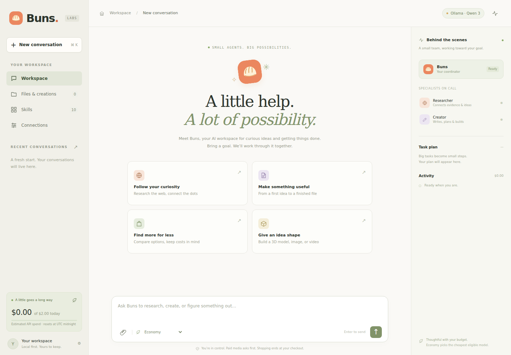

<div align="center">
  
  <h1>Buns</h1>
  <p><strong>A little help. A lot of possibility.</strong></p>
  <p>A Python AI workspace with a small coordinator, specialist agents, useful skills, and visible costs.</p>
</div>

Buns runs on your computer. Talk to it in a browser, watch its plan and activity, and download what it makes. Use a local Ollama model to avoid per-token API fees, or connect OpenAI-compatible providers. The repository is **Bun**; the assistant is **Buns**.



## What is included

| Capability | What works in this release | Setup needed |
|---|---|---|
| Chat & orchestration | Saved conversations, native tool calling, bounded coordinator loop, stop/resume after approval | A tool-capable language model |
| Small specialist agents | Research synthesis, writing, coding assistance, planning; configurable model per role | One model can cover all roles |
| Public web | Search with source links, page reading, redirect/IP validation, 15-minute search cache | Free DuckDuckGo search is best effort; optional Brave key |
| Documents & files | PDF, Word/DOCX, Markdown, TXT, CSV, JSON, HTML; uploads and scoped text reading | Runs locally |
| 3D geometry | Real downloadable cube, sphere and cylinder OBJ files | Runs locally |
| AI images, videos & 3D | Replicate prediction submission, approvals, persisted jobs, polling, local output downloads | Your API key, chosen models, input schemas and estimated costs |
| Shopping assistance | Research real listings, compare price/shipping/tax, link to seller checkout | Web access; you complete purchases |
| Cost controls | Cheapest eligible model routing, local-only mode, per-task/daily reservations, usage ledger | Current cloud rates entered and confirmed by you |
| Interface | Responsive chat, task plan/activity, files, skill switches, connection forms | Included; no Node build required |

**This is runnable application code, not a hosted service or a new trained model.** The UI/server starts immediately; useful AI replies require a running local model or configured model API. Paid media is disabled until configured. Buns does not log into accounts, run arbitrary commands, send messages, book things or buy items automatically. The architecture leaves room for carefully scoped future action skills.

## Start on Windows

Install [Python 3.11+](https://www.python.org/downloads/) (enable “Add Python to PATH”) and [Ollama](https://ollama.com/download). Open PowerShell:

```powershell
git clone https://github.com/MilkdromedaStudios/Bun.git
cd Bun
ollama pull qwen3:4b
powershell -ExecutionPolicy Bypass -File .\start.ps1
```

The execution-policy flag applies only to this launch process. If you prefer, use the manual commands below. If Git is unavailable, download the repository ZIP from GitHub, extract it and open PowerShell in the extracted directory.

Open **http://127.0.0.1:8000**. Go to **Connections → Ollama · Qwen 3 → Test connection**. Keep Ollama running. First model download is large; local inference speed depends on your RAM/CPU/GPU. You can choose a smaller or stronger tool-capable model in Connections.

## Start on macOS / Linux

Install Python 3.11+, Git and Ollama, then:

```bash
git clone https://github.com/MilkdromedaStudios/Bun.git
cd Bun
ollama pull qwen3:4b
bash start.sh
```

If Ollama is not running, start its application or run `ollama serve` in another terminal. Visit **http://127.0.0.1:8000**.

### Manual setup

```bash
python -m venv .venv
# macOS/Linux:
source .venv/bin/activate
# Windows PowerShell instead:
# .\.venv\Scripts\Activate.ps1
python -m pip install -r requirements.lock
python -m pip install --no-deps -e .
python -m buns
```

`requirements.lock` contains the tested dependency snapshot. `pip install -e .` alone also works but resolves versions within the ranges in `pyproject.toml`. No npm install is needed to run the application.

## Connect models, search and media

1. Copy `.env.example` to `.env`. Only set the provider keys you want to use. The CLI loads this file automatically; restart after changing environment keys.
2. Open **Connections**. Add the API base URL, exact model ID, key **environment-variable name**, supported roles, token parameter and current rates. Confirm the pricing checkbox for cloud models, then save and test.
3. For web search, use the free best-effort option or select Brave and set `BRAVE_API_KEY`. Free search can be blocked/rate limited; direct page reading remains available when the target permits access.
4. For image, video or AI 3D generation, set `REPLICATE_API_TOKEN`, then configure each media profile with a real `owner/model` or pinned `owner/model:version`, the prompt field, required default inputs and a conservative cost reservation. Refer to that model’s own input schema; models are not interchangeable.
5. Ask Buns to generate. The exact prompt, model and cost reservation appear for approval. Files → Refresh jobs retrieves finished outputs. Do not close the server until important media has downloaded.

Ollama is the default because it needs no hosted-model API key. Its model quality and speed depend on the model and your hardware. Economy mode selects the cheapest configured eligible model; for stronger results, assign the coordinator role to a stronger model. There is no magic universal provider key, guaranteed free cloud generation or automatic paid fallback.

The spend display is **an estimate**, based on configured rates, conservative reservations and returned token usage. Keep rates current and set billing limits in provider dashboards. A request timeout may still have incurred a charge, so uncertain reservations remain counted. See [cost semantics](docs/ARCHITECTURE.md#cost-semantics).

## Try these tasks

- “Research three mechanical keyboards under my budget. Ask my preferences first, then compare total known costs and cite seller links.”
- “Make a five-step plan for my science project and save it as a Word document.”
- “Read this uploaded CSV, explain the trend, and make a short PDF summary.”
- “Create a sphere as an OBJ file for Blender.”
- “Have the writer draft three names for my project, pick one, and create a Markdown brief.”
- After connecting a media profile: “Generate an image of a cozy miniature bakery.”

## Docker

Docker is optional. Copy `.env.example` to `.env`, generate a token with `python -c "import secrets; print(secrets.token_urlsafe(32))"`, and put it in `BUNS_AUTH_TOKEN`.

```bash
docker compose --profile local up --build -d
docker compose exec ollama ollama pull qwen3:4b
```

Visit http://127.0.0.1:8000 and unlock with that token. In Connections, change the Ollama base URL to **`http://ollama:11434/v1`** and save/test. The `local` profile starts Ollama on CPU; GPU support is platform-specific. Alternatively, start only Buns with `docker compose up --build -d` and connect to your existing host Ollama at `http://host.docker.internal:11434/v1` (your Ollama installation must accept that connection).

The web port binds only to host loopback. Chats/settings/files persist in the `buns-data` volume; models persist in `ollama-data`. Do not use `docker compose down -v` unless you intend to delete those volumes. The provided Docker recipe is included for deployment; local container execution may not be available in every development environment.

## Develop and test

```bash
python -m pip install -r requirements-dev.lock
python -m pip install --no-deps -e .
python -m pytest -q
python -m ruff check buns tests
python -m ruff format --check buns tests
```

The suite exercises real application workflows using a scripted HTTP provider: tool loops, file creation/download, media approvals and denial, budget accounting, specialist routing, cancellation, persistence and security boundaries. **Mocks verify the API contract, not the quality or live availability of any model.** Live paid generation requires your own configured credentials and was not used in automated tests.

Browser smoke test (Node is needed only for this test):

```bash
npm install --no-save playwright@1.58.2
npx playwright install chromium
# Terminal 1 — test-only fake provider, never use this as the production app:
python tests/ui_server.py
# Terminal 2:
node tests/browser-smoke.cjs
```

GitHub Actions runs Python 3.11/3.12/3.13 checks and the browser workflow. See [architecture](docs/ARCHITECTURE.md), [adding skills](docs/SKILLS.md), and [security](SECURITY.md).

## Troubleshooting

| Symptom | Fix |
|---|---|
| Cannot reach Ollama | Start Ollama, pull the exact model, check `http://localhost:11434/v1`, test the connection. |
| Model listed but tools fail | Choose a model/server that supports OpenAI function calling; match `max_tokens` vs `max_completion_tokens`. |
| Budget reached | Raise the appropriate limit after reviewing rates, or choose Local models only. Uncertain previous costs are retained. |
| Settings cannot be saved | Finish, decline, or stop pending tasks before editing configuration. |
| Web search returns nothing | Free search may be blocked. Supply a public page URL or configure Brave. Direct public DNS/network access is required. |
| Media error or stuck job | Verify model input schema, token, provider limits and prediction status. Use Refresh jobs; check the dashboard before resubmitting an unknown job. |
| Server restarted during a task | Completed files persist. Interrupted runs are not replayed; send a follow-up. Pending approvals and known media jobs remain available. |
| Download button fails | Unlock the workspace if token-protected; keep the same server data directory. |

Preserves the repository’s **Apache-2.0** license. Provider services and models have their own terms and licenses.
