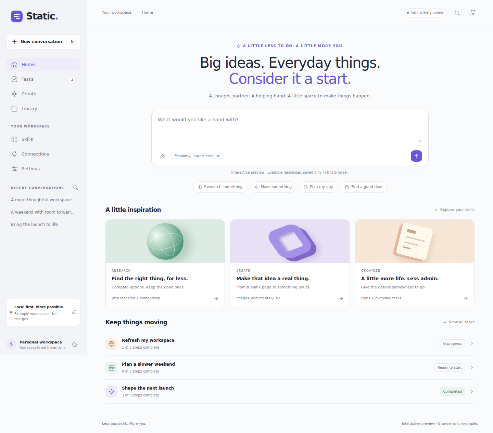
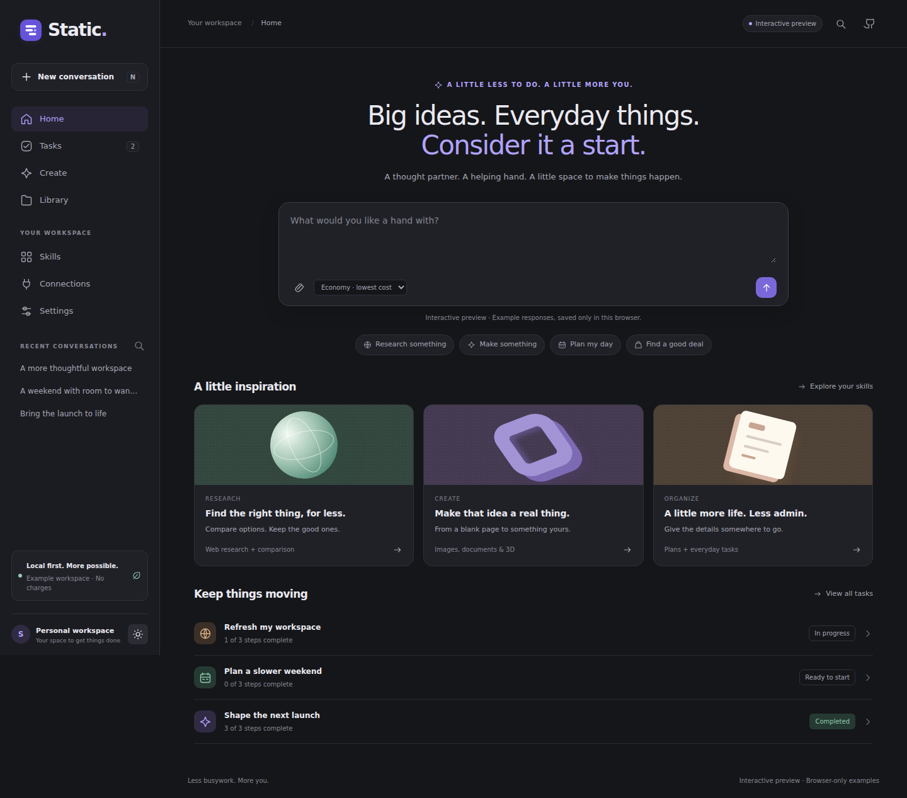

<div align="center">
  
  <h1>Static</h1>
  <p><strong>A little less to do. A little more you.</strong></p>
  <p>Your personal AI workspace. Research, plan, create, and keep good work moving.</p>
</div>

Static is a Python app with a task-oriented interface, a small AI coordinator, focused specialist agents, and 13 useful skills. It runs on your computer with your models. Start with Ollama for local inference, or connect OpenAI-compatible providers and generative media models.



<details>
<summary>See dark mode</summary>



</details>

## The workspace

| Page | What you can do |
|---|---|
| Home | Start a conversation, explore ideas, and pick up a saved goal. |
| Conversation | Talk with the coordinator, attach files, follow tool activity, approve media, and download results. |
| Tasks | Save goals, edit details, work through persistent checklists, and mark tasks complete. |
| Create | Make documents, images, video, 3D models, email drafts, and calendar files. |
| Library | Find, filter, preview text, and download your work. Track external media generations. |
| Skills | Enable or disable individual tools; extend the registry with trusted Python code. |
| Connections | Configure and test language models, role routing, media profiles, and provider costs. |
| Settings | Set a name, explicit preferences, spending limits, web search, and light/dark/system appearance. |

The interface is original to Static. Its goal-focused workflow takes inspiration from personal agents such as Muse. Static is independent of Meta and does not include Meta models, assets, accounts or services.

## Interactive preview / GitHub Pages

The static preview uses **the same interface** as the Python app, with a separate, explicitly selected demo adapter. It has eight real HTML pages, working navigation, example conversations, editable tasks, sample approvals, downloadable files, skill toggles, settings and persistent themes. It works at a repository subpath such as `/Static/`.

**Preview target:** [milkdromedastudios.github.io/Static/](https://milkdromedastudios.github.io/Static/) — available after Pages is enabled and the publishing workflow deploys successfully. See [Pages setup](docs/PREVIEW.md) if this link is not live yet.

```bash
python scripts/build_preview.py
python -m http.server 8080 --directory site
```

Open **http://localhost:8080**. Do not open `index.html` directly as a `file://` URL: browsers restrict JavaScript modules there.

The preview is deliberately simulated. Its fictional tasks and example files live in that browser's local storage. It makes **no model, search, payment, or backend API calls**, collects no API keys, and cannot host the Python server on GitHub Pages. The full app never silently falls back to demo responses. Reset examples in Settings; download anything you want to keep first.

The **Publish Static preview** workflow builds on every main-branch push. It retains a downloadable `static-preview` artifact even before Pages is enabled. Once **Settings → Pages → Source → GitHub Actions** is selected, run or rerun that workflow to publish.

## Start the Python app

Get the repository with Git or download its ZIP. The launch scripts check for Python 3.11+, ask before installing it with a supported package manager, then create a virtual environment and install the locked Python dependencies:

```bash
git clone https://github.com/MilkdromedaStudios/Static.git
cd Static
```

On **macOS / Linux**:

```bash
bash start.sh
```

On **Windows**, use PowerShell:

```powershell
powershell -ExecutionPolicy Bypass -File .\start.ps1
```

The execution-policy option applies only to that launch process. Alternatively, use the manual setup below. If Git is unavailable, download the repository ZIP, extract it, and run from that directory.

For local AI, Static offers to install Ollama if needed. On every launch it starts an installed Ollama server when the configured model uses `localhost:11434`; if the model is missing, it asks before downloading it. The server itself still opens if you skip local setup. The scripts use WinGet on Windows, Homebrew on macOS, and supported Linux package managers or Ollama's official installer. Unsupported setups get a direct install link.

Open **http://127.0.0.1:8000** and use **Connections → Test connection**. Local inference speed and model quality depend on your hardware. Model downloads may use several GB of disk space.

### Use API keys instead of Ollama

Copy `.env.example` to `.env` before starting. Configure a tool-capable model supported by your provider and **its actual prices**:

```dotenv
STATIC_API_KEY=your-secret-key
STATIC_CHAT_NAME=My API model
STATIC_CHAT_MODEL=the-model-id-in-your-account
STATIC_CHAT_BASE_URL=https://your-provider.example/v1
STATIC_CHAT_KEY_ENV=STATIC_API_KEY
STATIC_CHAT_INPUT_PER_MILLION=your-verified-input-price
STATIC_CHAT_OUTPUT_PER_MILLION=your-verified-output-price
STATIC_CHAT_PRICING_CONFIRMED=true
```

Run `start.sh` or `start.ps1`. On a fresh workspace, Static creates a cloud model profile from those values and skips Ollama installation and startup. The `.env` file stays on your computer and is git-ignored. You can also simply set a provider key, start the app, decline the Ollama prompt, and add the model through **Connections**. Existing `data/settings.json` takes precedence over first-run variables so later changes in the UI persist.

Language models use an OpenAI-compatible `/chat/completions` API; use the endpoint and exact ID your provider documents. `OPENAI_API_KEY`, `OPENROUTER_API_KEY`, or another variable can be selected with `STATIC_CHAT_KEY_ENV`. For live images, video, and generative 3D, set `REPLICATE_API_TOKEN` and configure each media profile in Connections. Brave web search uses `BRAVE_API_KEY`. No single API key is assumed to cover every provider. API charges remain subject to the configured per-run/daily estimates and media approvals.

### Manual setup

```bash
python -m venv .venv
# macOS/Linux:
source .venv/bin/activate
# Windows PowerShell instead:
# .\.venv\Scripts\Activate.ps1
python -m pip install -r requirements.lock
python -m pip install --no-deps -e .
python -m static_ai
```

The installed CLI is also available as `static-ai`. No npm or JavaScript build is needed to run the app. `requirements.lock` is the tested dependency snapshot; `pip install -e .` alone resolves versions within the declared ranges.

**Upgrading from Buns?** Existing `data/buns.db` is backed up into `data/static.db` automatically on first launch. Keep the same data directory so artifacts remain available. See [migration](docs/MIGRATION.md), especially for Docker volumes.

## What actually works

| Capability | Implementation | Required setup |
|---|---|---|
| Chat and orchestration | Saved conversations, native tool calls, bounded coordinator, visible action log | A language model with tool calling |
| Specialist agents | One focused researcher, writer, coder or planner call at a time; no recursive delegation | One model can cover all roles |
| Saved goals | Persistent tasks/checklists connected to conversations; work continues if you close the browser while the server stays running | Included |
| Public web research | Search, source links, page extraction, redirect/IP validation and search cache | Best-effort DuckDuckGo, or optional Brave key |
| Documents | PDF, Word, Markdown, text, CSV, JSON and HTML | Runs locally |
| File reading and analysis | Conversation-scoped uploads, text/PDF extraction, CSV row counts and numeric summaries | Runs locally |
| Email and calendar | Downloadable unsent `.eml` drafts and timezone-aware `.ics` event files | You review and send/import them |
| Procedural 3D | Real cube, sphere and cylinder OBJ geometry | Runs locally |
| AI images, video and 3D | Replicate submissions, one-use approvals, durable job polling, output downloads | Your chosen models, schemas, token and estimated prices |
| Shopping help | Research listings, compare price + shipping + known tax, link to seller | You complete checkout |
| Cost controls | Cheapest eligible configured model, local-only mode, per-run/daily reservations, usage ledger | Current cloud rates entered and confirmed by you |

Static does not log into accounts, autonomously purchase items, send messages, book travel, execute arbitrary code or run a general browser. Saved tasks are goals you start yourself, not a scheduler. There is no automatic semantic memory: preferences are explicit and editable. These boundaries are reflected in the available tools and interface.

## Connect your models

1. Copy `.env.example` to `.env`. Set only the provider secrets you use. The CLI loads the file; restart after changing environment variables. If you configured the first-run cloud profile above, it appears in Connections automatically.
2. In **Connections → Add model**, enter a compatible base URL, exact model ID, key **environment-variable name**, and verified provider rates. Save before testing. Advanced routing assigns models to coordinator/specialist roles.
3. In **Settings**, choose best-effort DuckDuckGo or Brave. Brave needs `BRAVE_API_KEY` and a conservative search-cost reservation. Free search can be blocked or rate limited.
4. For media, set `REPLICATE_API_TOKEN`, then configure the image/video/3D profile in Connections with a real `owner/model` or pinned version, its actual prompt field, required default inputs, and cost reservation. Model schemas differ; consult the chosen model's documentation.
5. Use **Create** or ask in chat. Paid media pauses for your approval with the prompt, model, inputs and reservation. **Library → Refresh status** retrieves updates. Keep the Python server running until outputs download.

Economy mode is a routing heuristic, not a guarantee of minimum possible cost or answer quality. Local-only mode excludes remote models and paid media/search. The spend display is an estimate; uncertain request outcomes retain reservations. Configure provider-side billing limits too. See [cost semantics](docs/ARCHITECTURE.md#cost-semantics).

## Try a few things

- “Research three keyboards under my budget. Ask my country and preferences first, then compare total known costs and cite seller links.”
- “Make a five-step plan for my science project and save a Word document.”
- “Analyze this CSV and make a short PDF summary.”
- “Prepare an email draft asking to move our meeting.”
- “Make a calendar file for a one-hour focus session. Ask my date and timezone first.”
- “Create a sphere as an OBJ file for Blender.”
- After connecting a media profile: “Generate an editorial image of a sculptural glass object.”

## Docker

Copy `.env.example` to `.env`. Generate a token with `python -c "import secrets; print(secrets.token_urlsafe(32))"` and set `STATIC_AUTH_TOKEN`.

```bash
docker compose --profile local up --build -d
docker compose exec ollama ollama pull qwen3:4b
```

Open http://127.0.0.1:8000 and unlock with that token. In Connections, set the Ollama URL to **`http://ollama:11434/v1`**, save and test. The optional local profile uses CPU by default; GPU setup is platform-specific. To use an existing host Ollama, start only Static with `docker compose up --build -d` and use `http://host.docker.internal:11434/v1` if that Ollama installation accepts the connection.

The web port binds to host loopback. Data is in the `static-workspace-data` volume, or the existing volume named by `STATIC_DATA_VOLUME`. Model storage uses `ollama-data`. Never run `docker compose down -v` unless you intend to delete those volumes. Docker is provided as a deployment recipe; local Docker execution was not part of this build's validation.

## Development and validation

```bash
python -m pip install -r requirements-dev.lock
python -m pip install --no-deps -e .
python -m pytest -q
python -m ruff check static_ai tests scripts
python -m ruff format --check static_ai tests scripts
```

The 42 backend tests cover real FastAPI/SQLite workflows with deterministic HTTP providers: plans, exports, approvals, costs, recovery, scope, authentication, migration and request boundaries. Browser tests cover both the Python UI and the Pages export. **No paid model calls are used; these tests verify behavior and contracts, not live model quality.**

For the browser suite, install Node and Playwright:

```bash
npm install --no-save playwright@1.58.2
npx playwright install chromium
python scripts/build_preview.py --output test-results/pages/Static
# Terminal 1 (test fixture only, not the production app):
python tests/ui_server.py
# Terminal 2:
python -m http.server 8766 --bind 127.0.0.1 --directory test-results/pages
# Terminal 3:
node tests/browser-smoke.cjs
```

GitHub Actions runs Python 3.11/3.12/3.13 checks and the browser suite, saving screenshots as artifacts. See [validation](docs/VALIDATION.md), [architecture](docs/ARCHITECTURE.md), [adding skills](docs/SKILLS.md), and [security](SECURITY.md).

## Troubleshooting

| Symptom | What to check |
|---|---|
| Cannot reach Ollama | Restart Static to auto-start an installed server, or check the model/base URL and test. Choose an API-key model if preferred. |
| Connection succeeds but tools fail | Use a model/server with function calling; match `max_tokens` or `max_completion_tokens`. |
| Budget reached | Review rates, then adjust limits or choose local-only. Uncertain costs remain counted. |
| Settings cannot be saved | Finish, decline or stop active runs before changing configuration. |
| Search returns nothing | Try a known public URL or configure Brave. Direct public DNS/network access is needed. |
| Media job is stuck | Check the provider's schema, key and dashboard before resubmitting an unknown job. |
| Server restarted mid-task | Files persist. Send a follow-up for an interrupted run; known media jobs resume polling. |
| Preview URL is 404 | Enable Pages with source **GitHub Actions**, then run **Publish Static preview**. |
| Preview edits disappeared | Local storage belongs to that browser and origin. Download important examples; use the Python app for durable work. |

Apache-2.0 licensed. Provider services and models have their own licenses and terms.
